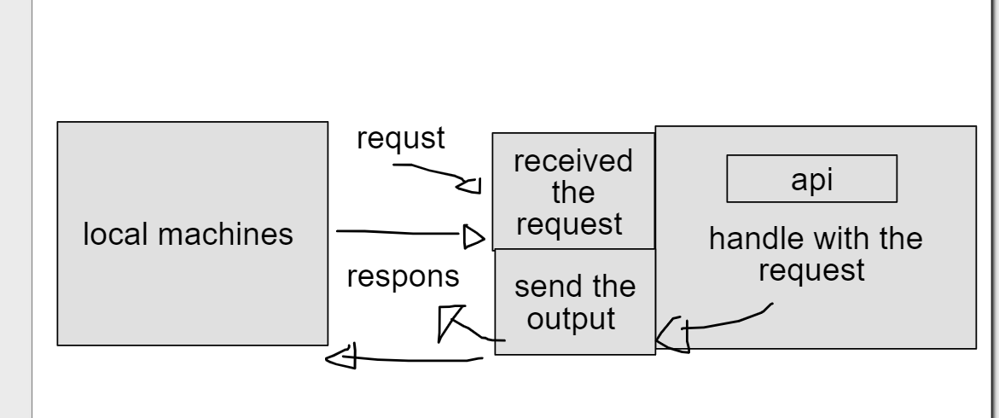

# City Explorer

**Author**: Qutadah Almomani
**Version**: 7.21.1 

## Overview

to apply the map from api .

## Getting Started
node , bootstrab , Axios 

## Architecture

## Change Log
<!-- Use this area to document the iterative changes made to your application as each feature is successfully implemented. Use time stamps. Here's an example:

01-01-2001 4:59pm - Application now has a fully-functional express server, with a GET route for the location resource. -->

## Credit and Collaborations
my partner in 5/9/2021 is Nashat Alzaatreh

Name of feature: ________________________________

Estimate of time needed to complete: _____

Start time: _____

Finish time: _____

Actual time needed to complete: _____